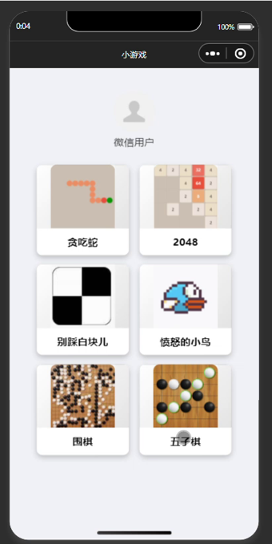
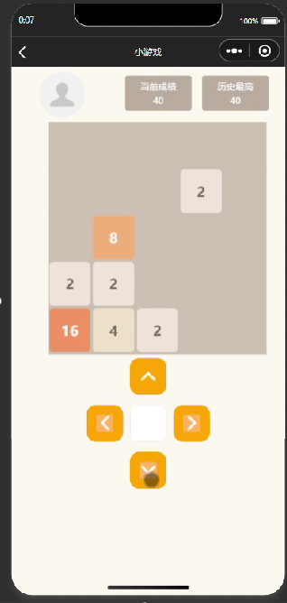
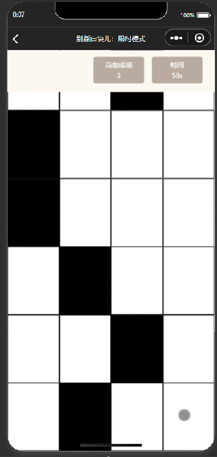
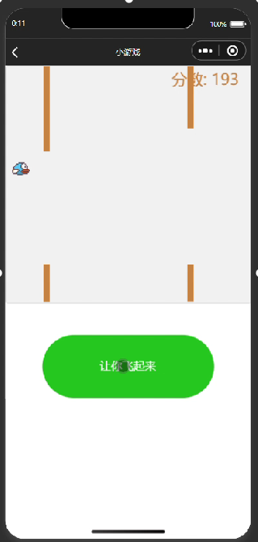
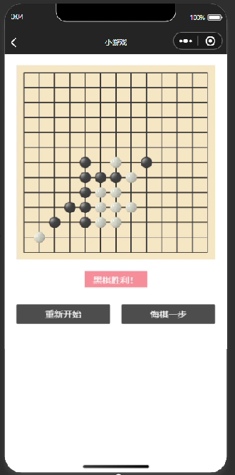

# 微信小程序小游戏合集

一个基于微信小程序开发的小游戏合集项目，包含贪吃蛇、2048、别踩白块儿、飞翔的小鸟、围棋和五子棋等多个小游戏。项目涵盖了小程序页面开发、Canvas 绘图、游戏状态管理、定时器动画、棋类胜负判断、简单 AI 逻辑以及本地 Node.js 后端联动等内容。

## 项目简介

本项目以“小游戏合集”为主题，用户可以在首页选择不同游戏进行游玩。不同游戏分别采用了网格数组、Canvas 绘图、事件监听、定时器刷新、碰撞检测、棋盘搜索、启发式评分等实现方式。

其中，围棋 AI 模式通过本地 Node.js 服务调用 KataGo 进行落子计算；五子棋 AI 模式则使用前端启发式评分算法实现简单的人机对战。

## 功能特点

- 多个小游戏集成在同一个微信小程序中
- 首页统一管理游戏入口
- 支持普通休闲类游戏和棋类游戏
- 使用 Canvas 实现棋盘、角色、障碍物等绘制
- 使用二维数组维护棋盘、地图和游戏状态
- 支持双人对战和 AI 对战模式
- 围棋 AI 支持本地 Node.js 后端调用 KataGo
- 代码结构清晰，方便继续扩展新的小游戏

## 游戏展示

### 总页面


### 2048

基于数字合并规则实现的 2048 游戏。玩家通过滑动方向移动方块，相同数字相撞后合并。



### 别踩白块儿

玩家需要点击黑色方块，不能点击白色方块。随着游戏进行，玩家需要快速判断并完成点击操作。



### 飞翔的小鸟

类似 Flappy Bird 的小游戏。玩家通过点击控制小鸟上升，避开障碍物并获得分数。




### 五子棋

五子棋游戏支持双人对战和 AI 对战模式。双人模式由黑白双方轮流落子，AI 模式通过评分函数选择较优落点。



还有贪吃蛇和围棋为篇幅所限不展示了


## 技术栈

### 小程序前端

- 微信小程序原生开发
- WXML
- WXSS
- JavaScript
- Canvas API
- 小程序页面路由
- 小程序事件处理
- 本地数据状态管理

### 后端服务

- Node.js
- Express
- KataGo
- GTP 协议调用

## 项目结构

```text
.
├── app.js
├── app.json
├── app.wxss
├── pages
│   ├── index          # 首页
│   ├── snake          # 贪吃蛇
│   ├── 2048           # 2048
│   ├── block          # 别踩白块儿
│   ├── bird           # 飞翔的小鸟
│   ├── weiqi_BT       # 围棋双人模式
│   ├── weiqi_AI       # 围棋AI模式
│   ├── wuziqi_BT      # 五子棋双人模式
│   └── wuziqi_AI      # 五子棋AI模式
├── go-ai-server
│   ├── server.js      # 围棋AI后端服务
│   └── package.json
└── docs
    └── images         # README截图目录
```

## 本地运行

### 1. 克隆项目

```bash
git clone https://github.com/amieon/WeChatGames.git
cd WeChatGames
```

### 2. 使用微信开发者工具打开项目

打开微信开发者工具，选择本项目目录，即可运行小程序前端。

如果只是体验普通小游戏和五子棋模式，可以直接运行小程序；如果需要体验围棋 AI 模式，还需要启动本地 AI 后端服务。

## 围棋 AI 后端运行方式

围棋 AI 模式需要本地安装并配置 KataGo。

### 1. 进入后端目录

```bash
cd go-ai-server
```

### 2. 安装依赖

```bash
npm install
```

### 3. 配置环境变量

Windows PowerShell 示例：

```powershell
$env:KATAGO_PATH="D:\KataGO\katago-v1.16.2-eigen-windows-x64\katago.exe"
$env:KATAGO_MODEL_PATH="D:\KataGO\katago-v1.16.2-eigen-windows-x64\model.bin"
$env:KATAGO_CONFIG_PATH="D:\KataGO\katago-v1.16.2-eigen-windows-x64\fast_gtp.cfg"
```

如果需要接口鉴权，可以额外设置：

```powershell
$env:AI_API_TOKEN="your_token_here"
```

### 4. 启动后端

```bash
node server.js
```

默认服务地址为：

```text
http://127.0.0.1:3000
```

小程序中的围棋 AI 页面会向该服务发送棋盘数据，并接收 AI 返回的落子位置。

## 安全说明

本项目中与密钥、路径和本地配置相关的内容不建议直接提交到 GitHub。推荐使用环境变量管理本地路径和接口 token。

建议 `.gitignore` 中包含以下内容：

```gitignore
node_modules/
go-ai-server/node_modules/
go-ai-server/gtp_logs/
project.private.config.json
*.log
.env
.env.*
.DS_Store
```

如果项目中曾经出现过微信小程序 `appsecret`，请不要提交到公开仓库；如果已经提交过，建议及时重置密钥。

围棋 AI 后端默认建议只在本地运行，不建议直接暴露到公网。如果确实需要公网访问，应添加 token 鉴权、请求频率限制、请求体大小限制和输入校验。

## 后续优化方向

- 完善排行榜功能
- 优化页面 UI 和动画效果
- 增加更多小游戏
- 优化围棋和五子棋 AI 难度
- 增加游戏音效
- 增加游戏暂停、重新开始、历史最高分等功能
- 优化移动端真机适配
- 整理更多项目截图和演示 GIF

